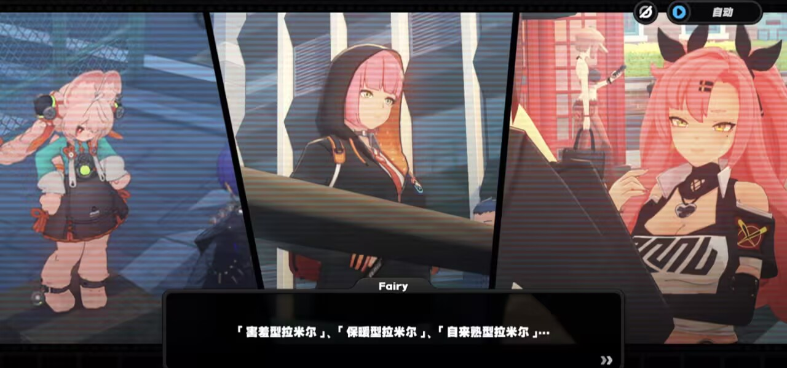
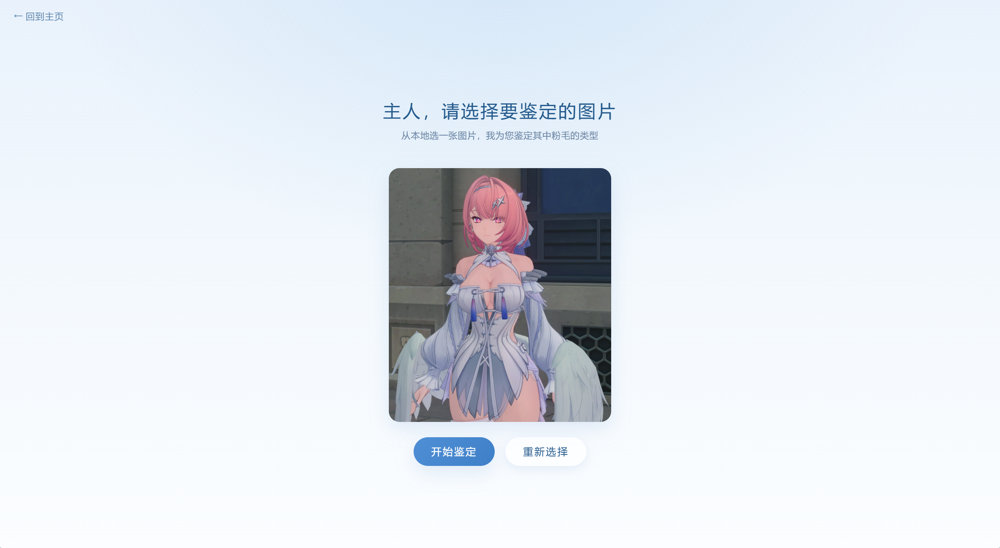
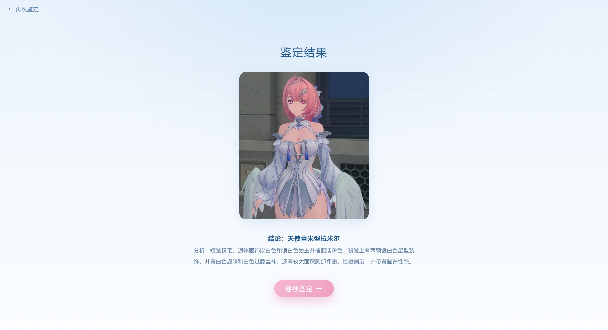
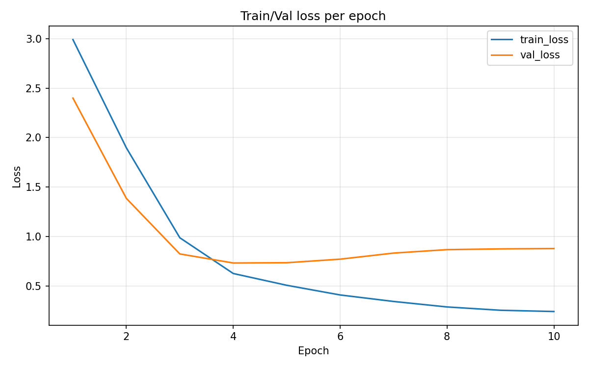
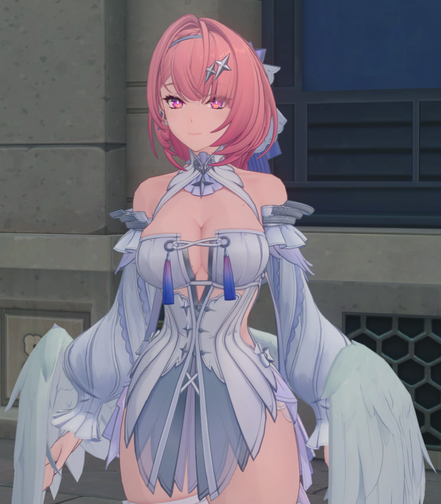

# 拉米尔鉴定——基于VLM LoRA微调的粉毛角色特征归纳与开放式分类系统

基于 Qwen2.5-VL-3B-Instruct 的 LoRA 轻量微调项目：输入一张动漫图片，VLM 整体判断图中是否存在粉毛角色；存在则对每个粉毛角色输出"结论：xxx型拉米尔 + 分析：判断依据"的结构化文本，不存在则输出"未识别到粉毛角色"。

开发方式为规格驱动 + 多 Agent 协作开发，代码可直接在 PyCharm 中运行调试。

## 背景
项目起源我们非常经典的对话：fairy帮忙寻找拉米尔的这一段。所以设计了这个比较简陋的项目。

 

## 核心特性

- **闭集 / 开放集双轨数据**：闭集文件夹（整文件夹共享一个固定类型标签）做类型匹配，开放集文件夹（逐图自由标签）训练开放式生成能力
- **开放式类型生成**：闭集匹配优先，无法匹配时模型自行生成新类型，推理保留采样随机性（temperature / top_p）
- **LoRA 轻量微调**：只训练 adapter 权重（约 0.30% 参数），微调后仅保存 LoRA checkpoint，预留合并导出工具函数
- **多角色识别**：一个角色一段"结论 + 分析"，自动编号（角色1、角色2……）
- **结构化输出**：推理结果统一落盘为 `outputs/Ani_type/{图片名}_result.txt`

## 效果示例

**单角色**（实测样例，`outputs/Ani_type/example_result.txt`）：

```
结论：XXX型拉米尔
分析：……
```

**多角色**（每个角色一段，段间空行、段前标注序号）：

```
角色1
结论：战斗型拉米尔
分析：……

角色2
结论：嘉豪型拉米尔
分析：……
```

**未识别到粉毛角色**：

```
未识别到粉毛角色
```

## 项目结构

```
Ramir_appraisal/
├── dataset/                      # 训练数据
│   ├── imgs1/ ~ imgs6/           # 每文件夹 18 张图；imgs1~imgs4 为闭集，imgs5~imgs6 为开放集
│   └── descriptions/
│       └── imgs1.json ~ imgs6.json   # 每条记录含 path / label / analysis 三个字段
├── models/
│   └── Qwen2.5-VL-3B-Instruct/   # 已下载的 VLM 基座模型（平铺目录）
├── outputs/
│   ├── train_models/             # LoRA adapter：epoch{e}_step{s}/ 定期存档 + best/ + latest/
│   ├── curve/                    # 训练曲线 png（loss_per_step / loss_per_epoch / learning_rate）+ metrics.json
│   └── Ani_type/                 # 推理结果 {图片名}_result.txt
├── inputs/                       # 待测试图片
├── fairy.png                     # 前端主视觉素材（中心圆形眼睛，其余已透明化）
├── web/                          # 前端页面（app.py 托管）：封面 / 选图 / 思考中 / 结果
├── app.py                        # Web 服务入口：托管 web/ 静态页 + POST /api/predict 图片鉴定接口
├── config.py   data.py   model.py   utils.py   train.py   test.py    # 本机版（6 个）
├── config1.py  data1.py  model1.py  utils1.py  train1.py  test1.py   # 4090 服务器版（同名 + 1 后缀）
├── datatodata.py                 # 图片批量格式转换工具（统一转 PNG/RGB）
├── docs/
│   └── requirements.md           # 实现规格文档
└── 项目技术报告.docx             # 完整技术细节与问题记录
```

**双版本体系**：本机版（`config.py` ~ `test.py`）针对 8GB 级显存调参；大显存版（`config1.py` ~ `test1.py`，24GB 显存）为高分辨率重训配置。两套代码同构，唯一的行为分界是各自的 config 文件，训练 / 推理流程完全一致。

## 技术栈

开发环境：PyCharm + conda 的 DL 环境（Python 3.9，CUDA 版 PyTorch）。

| 依赖 | 版本 |
| --- | --- |
| torch | 2.2.1（sdpa 注意力，无需 flash-attention） |
| transformers | 4.51.3（`AutoModelForVision2Seq` 加载，无需 trust_remote_code） |
| peft | 0.17.1 |
| Pillow | 最新即可 |
| matplotlib | 最新即可 |
| numpy / tqdm | 最新即可 |

## 快速开始

### 1. 环境准备

```bash
pip install torch transformers peft pillow matplotlib numpy tqdm
```

版本以本机环境为准（torch 2.2.1 / transformers 4.51.3 / peft 0.17.1，如用 pip 装 torch 请按官网匹配 CUDA 版本）。

**数据放置**：按上面的 dataset[数据集](https://huggingface.co/datasets/ZerothX/Ramir_appraisal/tree/main "点击访问线上地址") 结构放好，每个图片文件夹对应一个同名 JSON（如 `imgs1/` 对应 `descriptions/imgs1.json`），数据集一些标签需要人工写，所以本人只写了4个闭集2个开集108张图的数据，比较简陋，格式：

```json
[
    {
        "path": "imgs1/001.png",
        "label": "天使蕾米型拉米尔",
        "analysis": "短发粉毛，通体服饰以白色和银白色为主……"
    }
]
```

闭集文件夹名单在 `config.py` 的 `CLOSED_SET_DIRS` 显式指定，不在名单内的 `imgs*` 一律按开放集处理（逐图标签，行数必须与图片数一致）。

**模型放置**：将 Qwen2.5-VL-3B-Instruct 完整目录放到 `models/Qwen2.5-VL-3B-Instruct/`。

### 2. 训练

PyCharm 中运行 `train.py`（或命令行 `python train.py`）。所有超参数在 `config.py` 顶层集中调整，无需改动其他文件：

| 常用超参数 | 说明 |
| --- | --- |
| `NUM_EPOCHS` / `BATCH_SIZE` / `GRADIENT_ACCUMULATION_STEPS` | 训练规模 |
| `IMAGE_SIZE` | 输入分辨率（None 为模型默认，整数 N 固定 N×N） |
| `LORA_R` / `LORA_ALPHA` / `LORA_DROPOUT` | LoRA 配置 |
| `LEARNING_RATE` / `WARMUP_RATIO` / `LR_SCHEDULER_TYPE` | 优化策略 |
| `MIXED_PRECISION` | bf16 / fp16 / no |
| `EARLY_STOP_PATIENCE` | 验证 loss 连续 N 个 epoch 未创新低则提前停止（0 关闭） |
| `TRAIN_WITH_ANALYSIS` | 训练目标是否包含"分析："行 |

产物：`outputs/train_models/`（LoRA adapter，含 best / latest 两份）+ `outputs/curve/`（曲线图 + `metrics.json` 原始数据）。

### 3. 推理

1. 修改 `test.py` 顶部的 `TEST_IMAGE_PATH`（默认 `inputs/example.jpg`）；
2. 在 `config.py` 中设置 `CHECKPOINT_SELECT = "best"`（验证集最优）或 `"latest"`（最新）；
3. 运行 `test.py`，结果写入 `outputs/Ani_type/{图片名}_result.txt` 并同步打印到控制台。

注意：推理保留采样随机性（`GEN_DO_SAMPLE=True`），同一张图多次运行结果可能不完全一致，这是开放式输出设计目标的预期行为。

### 4. Web 前端（封面 → 选图 → 思考中 → 结果）

PyCharm 运行 `app.py`（或命令行 `python app.py`），浏览器打开 http://127.0.0.1:8000/ 即可使用：

前端设计参考使用我们超级管家助手fairy的大眼睛。
1. **封面页**：以 fairy眼睛为主视觉，蓝→浅蓝放射渐变背景，点"进入鉴定 →"进入选图页；
   
   
3. **选图页**：点击或拖拽本地图片（前端自动压缩后上传），点"开始鉴定"跳转思考页；
   
     
5. **思考页**：眼睛图标呼吸 + 涟漪动画，同时调用后端 `POST /api/predict` 推理（复用 `test.py` 的 `predict_image` 管线，模型全局单例只加载一次，首次请求会自动后台预热）；
   
    
7. **结果页**：展示原图与鉴定结果（结论 / 分析分行渲染）。
   
    

说明：
- 端口、上传大小限制等在 `app.py` 顶部的 `HOST / PORT / MAX_UPLOAD_MB` 调整；
- 模型加载复用 `test.py` 的 `load_model_once`（基座 + best/latest LoRA，与命令行推理同一份代码）；
- 推理同样保留采样随机性，多次鉴定同一张图结果可能不完全一致；
- 服务启动时后台预加载模型（约 1~2 分钟），期间 `GET /api/status` 返回 `ready: false`，前端思考页会显示"正在唤醒模型"提示。

## 如果显存充足

`config1.py` ~ `test1.py` 专为 24GB 显存服务器设计，运行方式与本机版完全相同（`train1.py` / `test1.py`，`test1.py` 顶部改 `TEST_IMAGE_PATH`）。两套代码的唯一行为分界是配置文件：

| 配置项 | 本机版 `config.py` | 大显存版 `config1.py` |
| --- | --- | --- |
| BATCH_SIZE | 1 | 8 |
| GRADIENT_ACCUMULATION_STEPS | 4 | 2（有效 batch 同为 16） |
| IMAGE_SIZE | 512 | 2048（保留服饰/配件/表情细节） |
| LoRA 目标模块 | q/k/v/o_proj + 视觉 qkv/proj | 追加语言侧 MLP 层（gate/up/down_proj） |
| 适用显存 | 约 8.6GB | 24GB |

本机版受 8.6GB 显存限制：512 分辨率 + batch 1 是实测可行配置（batch=4 会 OOM；模型默认分辨率下大图峰值约 10.4GB，超物理显存导致换页极慢）。若服务器显存更大（48GB+），可进一步将 `BATCH_SIZE` 提到 16、`IMAGE_SIZE` 提到 3072。

## 训练结果

本机版一次完整训练（10 epoch）实测数据（原始记录见 `outputs/curve/metrics.json`）：

| 指标 | 数值 |
| --- | --- |
| 数据规模 | 108 样本（闭集 72 + 开放集 36，6 文件夹 × 18 张） |
| 训练轮数 / 优化步数 | 10 epoch / 242 step |
| Train loss | 2.99 → 0.24 |
| Val loss | 最低 0.731（epoch 4），后回升至 0.877（epoch 10） |
| 可训练参数 | 11,304,960（占全模型 0.30%） |
| LoRA 配置 | r=16，α=32，dropout 0.05 |

损失曲线：



训练 loss 收敛良好且无震荡，说明梯度累积 + bf16 + 掩码策略工作正常，数据链路（含视觉侧梯度修复后）完整。
验证 loss 在 epoch 4 达到最低 0.731，之后缓慢回升至 0.877——典型的过拟合信号：108 张的小数据集 + 10 epoch，模型开始"死记"训练样本细节（如具体图像背景）而非泛化类型语义。
train 与 val 的 gap 从 epoch 4 起逐步拉大，同样指向过拟合；本机 512 分辨率进一步加剧了这一效应（细节不足时模型更依赖记忆）。

说明：小数据（108 样本）训练下验证 loss 自 epoch 4 起回升，属正常过拟合；512 分辨率下服饰/配饰等细节信息受限，推理质量有损。建议在 4090 服务器以 2048 分辨率、更大 LoRA 容量重训。

## 演示与分析

在人工测试分析时，使用inputs里的6张图测试：

<div align="center" style="display:flex; justify-content:center; gap:20px;">
  <figure>
    
    <figcaption align="center">图1</figcaption>
  </figure>
  <figure>
    
    <figcaption align="center">图2</figcaption>
  </figure>
  <figure>
    
    <figcaption align="center">图3</figcaption>
  </figure>
  <figure>
    
    <figcaption align="center">图4</figcaption>
  </figure>
  <figure>
    
    <figcaption align="center">图5</figcaption>
  </figure>
  <figure>
    
    <figcaption align="center">图6</figcaption>
  </figure>
</div>

对于处于闭集的类型（图1、图4）应该输出闭集设定好的类型和说明，处理更像人物识别；
对不在闭集的角色人物，则会根据人物的服装和性格等归纳其特征，整理成某种类型并附上评判理由；
多次测试会出现不同结果，为尽可能开放性结论需求产生的正常现象。
本项目受限于数据集的数量和显存限制，得到效果可能不佳，请理性看待。

- 对于图1，结果应该为开集结果，即开放性结论，出现误判为闭集类型的情况，分析里夹杂着大量闭集和开集里的类型说明混用。
- 对于图2，结果应该为闭集结果，分析结果为设定好的，多次分析后未出现问题。
- 对于图3，结果应该为开集结果，结果符合图中人物，无明显问题。
- 对于图4，结果应该为开集结果，也出现误判为闭集的情况，分析也为闭集某类的分析说明。
- 对于图5，结果应该为闭集结果，却出现了开放性结论，尝试多次并更换多张图片后未识别小三月，未出现预先设定闭集结果。
- 对于图6，结果应该为开集结果，结果符合图中人物，无明显问题。

综上，虽然效果不稳定但基本能实现相应效果，若丰富数据集并换用显存充足的GPU，效果会有所改善。
